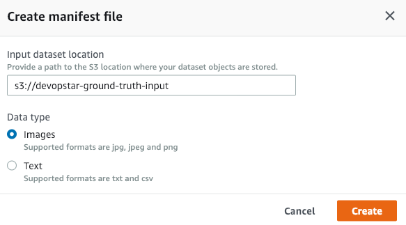
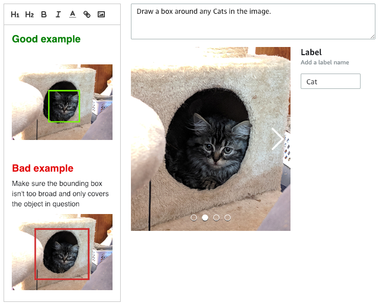
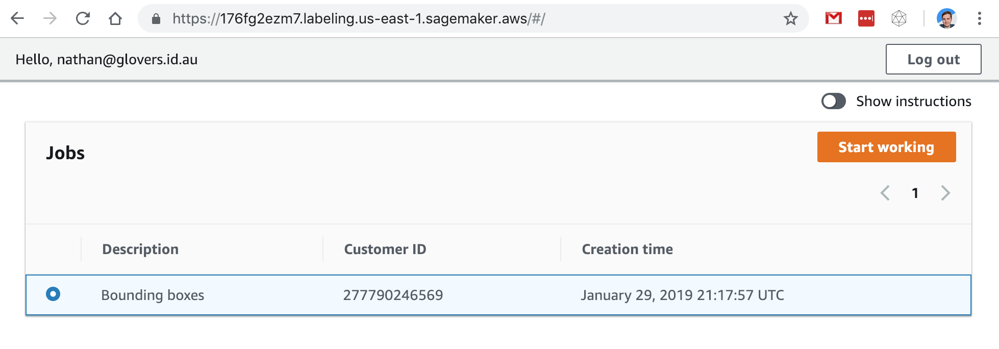
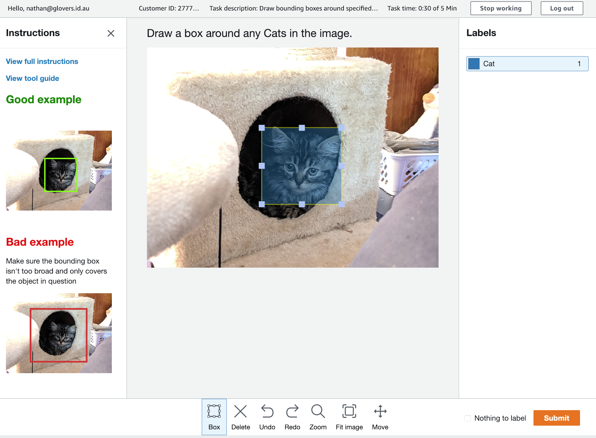
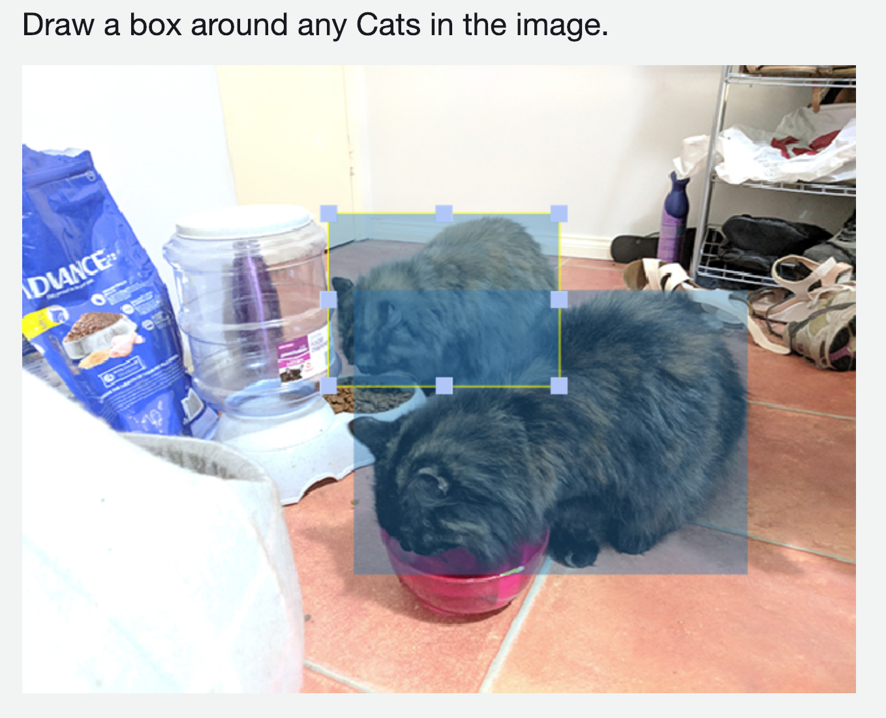
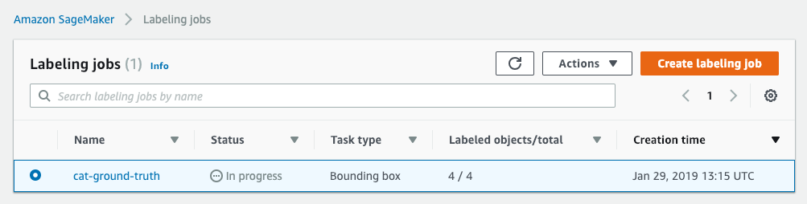
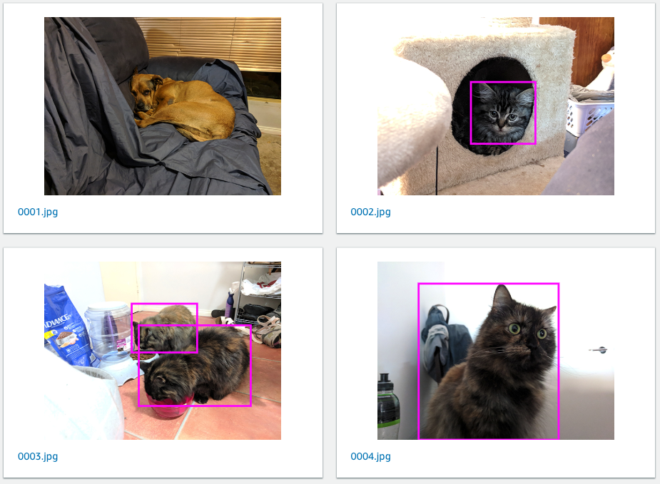
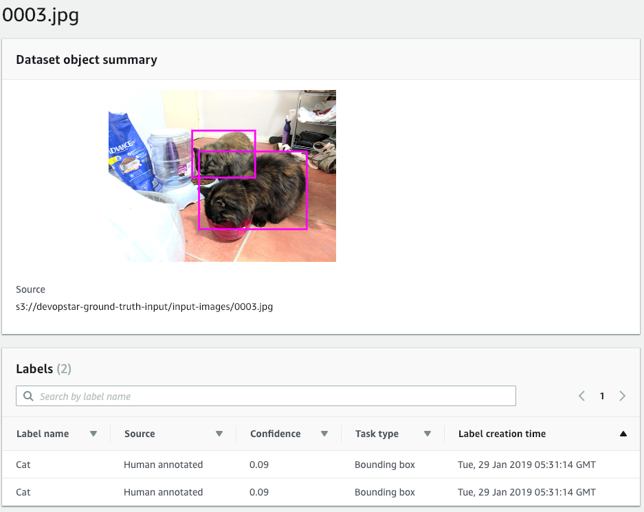

# Ground Truth Cat Labels

A sample project for getting started with AWS SageMaker Ground Truth

## Create S3 bucket for input and output content

```bash
aws s3 mb s3://devopstar-ground-truth-input
aws s3 mb s3://devopstar-ground-truth-output
```

## Copy in Input Images and Manifest

```bash
aws s3 cp res/good-example.jpg s3://devopstar-ground-truth-input/good-example.jpg
aws s3 cp res/bad-example.jpg s3://devopstar-ground-truth-input/bad-example.jpg
aws s3 cp res/manifest.json s3://devopstar-ground-truth-input/manifest.json
aws s3 sync res/input-images s3://devopstar-ground-truth-input/input-images
```



## Setup Bounding box Labeling



## Run Labeling



Start labeling!



It even supports multiple selections



## Finishing Up







## Output

You can download a copy of the output manifest that contains the labels

```bash
aws s3 cp s3://devopstar-ground-truth-output/cat-ground-truth/manifests/output/output.manifest output.manifest
```

```json
"source-ref": "s3://devopstar-ground-truth-input/input-images/0002.jpg",
"cat-ground-truth": {
    "annotations": [{
        "class_id": 0,
        "width": 164,
        "top": 165,
        "height": 157,
        "left": 237
    }],
    "image_size": [{
        "width": 601,
        "depth": 3,
        "height": 453
    }]
},
"cat-ground-truth-metadata": {
    "job-name": "labeling-job/cat-ground-truth",
    "class-map": {
        "0": "Cat"
    },
    "human-annotated": "yes",
    "objects": [{
        "confidence": 0.09
    }],
    "creation-date": "2019-01-29T13:29:11.847049",
    "type": "groundtruth/object-detection"
}
```

## HTML Elements

Docs: [https://docs.aws.amazon.com/sagemaker/latest/dg/sms-ui-template-reference.html](https://docs.aws.amazon.com/sagemaker/latest/dg/sms-ui-template-reference.html)
